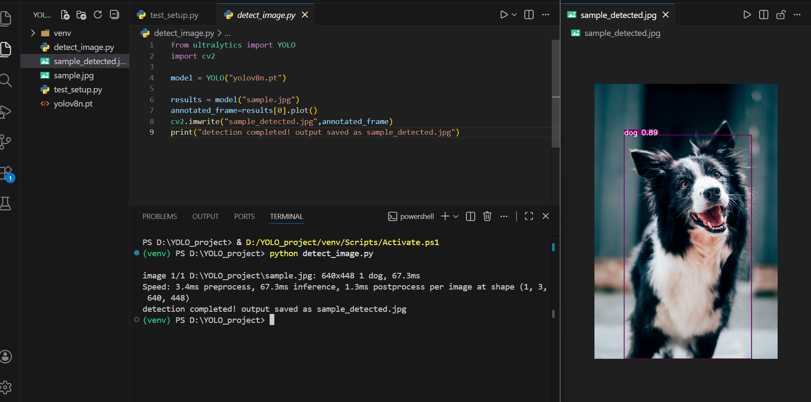

# YOLOv8 Object Detection Project

## Overview
This project uses YOLOv8, a deep learning model, to detect objects in images. The model scans an image, identifies objects like people, cars, or animals, and draws bounding boxes with labels around them. The project is a foundation for real-time computer vision applications, such as webcam detection, robotics, and automated monitoring.

## Day 1 Progress
- Python virtual environment setup completed
- Required libraries installed: PyTorch, OpenCV, Ultralytics YOLOv8
- YOLOv8 pre-trained model downloaded (yolov8n.pt)
- Detection works on a sample image (`sample.jpg`)
- Detection output saved as `sample_detected.jpg`
- ## Screenshot proof 
  

## Next Steps
- Extend YOLO on webcam for real-time object detection
- Add optional improvements like object counting or tracking