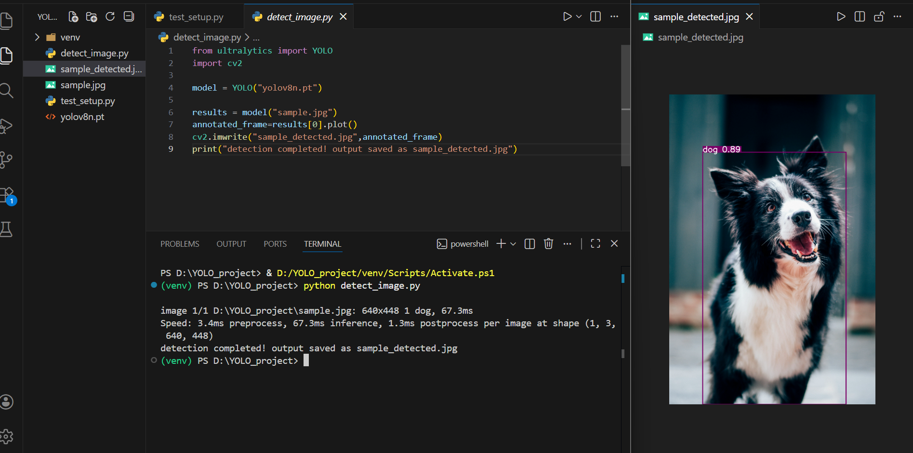

# YOLOv8 Object Detection Project

## Overview
This project uses YOLOv8, a deep learning model, to detect objects in images. The model scans an image, identifies objects like people, cars, or animals, and draws bounding boxes with labels around them. The project is a foundation for real-time computer vision applications, such as webcam detection, robotics, and automated monitoring.

## Day 1 Progress
- Python virtual environment setup completed
- Required libraries installed: PyTorch, OpenCV, Ultralytics YOLOv8
- YOLOv8 pre-trained model downloaded (yolov8n.pt)
- Detection works on a sample image (`sample.jpg`)
- Detection output saved as `sample_detected.jpg`
- ## Screenshot proof 
  

## Day 2 progress
- Webcam integration:
  Used cv2.VideoCapture(0) to access the system webcam.
  Ensures that detection is tested on dynamic, real-world input.

- FPS measurement and smoothing:
  Calculated FPS per frame to measure speed: fps = 1 / (current_time - prev_time)
  Applied moving average over last 10 frames → reduces fluctuations and makes FPS more reliable for analysis.

- Logging:
  Logs stored in outputs/logs/logs.txt
  Each log includes timestamp, FPS, number of objects detected, and confidence scores.
  Purpose: Quantitative evidence for research comparison.

-Video recording and screenshots:
  Annotated frames saved to video using cv2.VideoWriter.
  Key frames saved as screenshots using cv2.imwrite.
  Purpose: Provides visual proof of detection performance.

## Next step
- Compare YOLOv8s vs YOLOv8n inference models to analyze speed vs accuracy trade-offs.
- Try YOLOv8s custom training :
  Fine-tune on your dataset to detect obstacles better.
  Compare FPS and accuracy after fine-tuning.