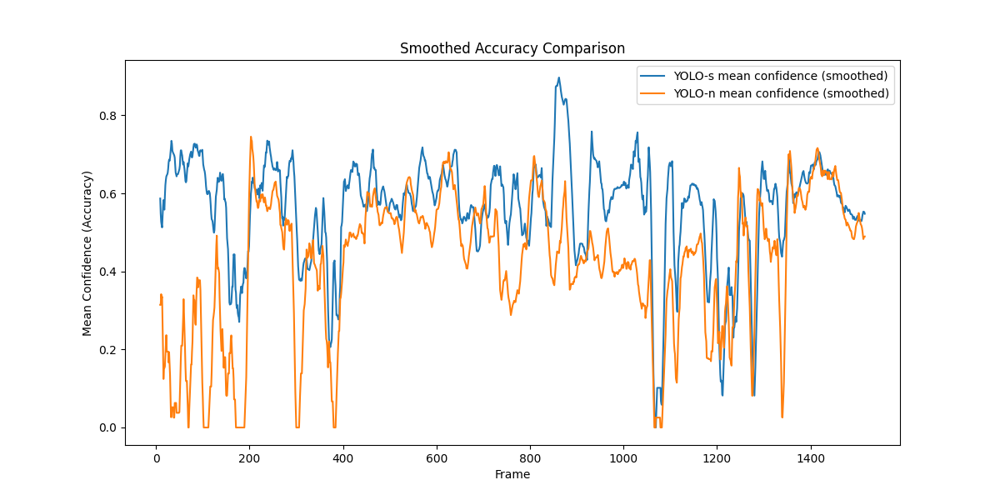
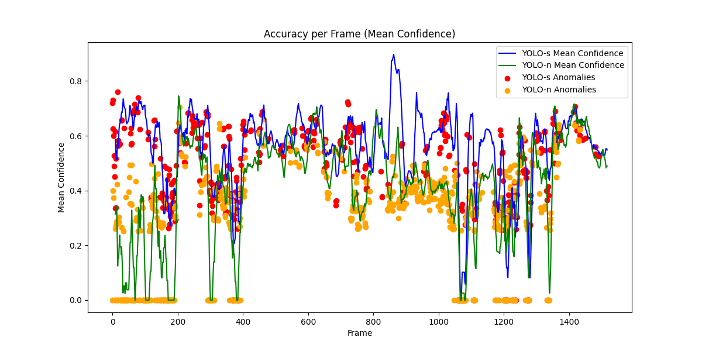
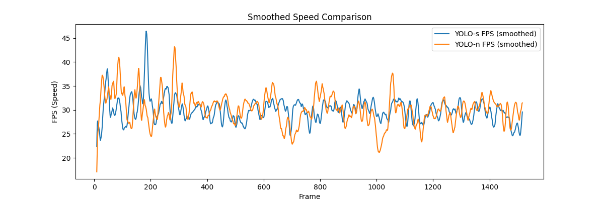
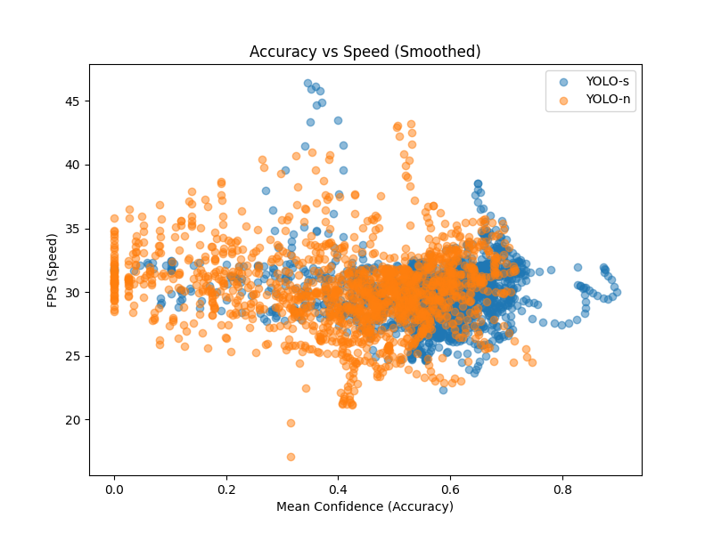

# YOLOv8 Object Detection: Comparative Analysis

## Overview
This project compares two YOLOv8 models — YOLOv8n and YOLOv8s — for object detection in video data. The goal is to evaluate their performance in terms of **accuracy, speed, and real-time usability**, and provide guidance on model selection for practical applications such as robotics and edge AI.

## Methodology
- **Setup:**  
  - GPU-enabled inference using Python, OpenCV, and Ultralytics YOLOv8.  
  - Pre-trained models `yolov8n.pt` and `yolov8s.pt` used for evaluation.

- **Inference & Logging:**  
  - Each frame of the sample video was processed to detect objects.  
  - Logs record timestamp, FPS, number of objects, and per-object confidence scores.

- **Metrics Computed:**  
  - **Accuracy:** Mean confidence per frame (`conf_mean`).  
  - **Stability:** Standard deviation of confidence (`conf_std`), and min/max confidence per frame.  
  - **Usability:** Frames with confidence ≥ 0.5 and FPS ≥ 15.  
  - **Anomalies:** Frames where `conf_max < 0.5`, `conf_mean < 0.4`, or `conf_std > 0.25`.

- **Visualization:**  
  - Rolling average (10 frames) applied to FPS and confidence to reduce noise.  
  - Generated plots include:  
    - Smoothed confidence per frame for both models.  
    - FPS per frame comparison.  
    - Accuracy vs Speed scatter plot.  
    - Highlighted anomalies in red/orange for visual reference.

## Key Results

| Metric            | YOLO-s | YOLO-n |
|-------------------|--------|--------|
| Mean Confidence   | 0.563  | 0.420  |
| Max Confidence    | 0.973  | 0.939  |
| Std Confidence    | 0.197  | 0.133  |
| Anomaly Frames    | 516    | 720    |
| Average FPS       | 29.89  | 30.14  |
| Max FPS           | 50.31  | 46.03  |
| Usable Frames     | 1129   | 620    |

### Observations
- YOLO-s shows higher accuracy and fewer anomaly frames, making it more reliable for real-time applications.  
- YOLO-n is slightly faster but has lower confidence and more unusable frames.  
- Overall, YOLO-s is better suited when accuracy and stability are critical, while YOLO-n can be considered when speed or lightweight deployment is prioritized.

## Visual Evidence
- Smoothed confidence comparison:  
    
- Accuracy per frame with anomalies:  
    
- FPS comparison:  
    
- Accuracy vs speed scatter:  
    

## Conclusion
This comparative analysis of YOLOv8n and YOLOv8s demonstrates the trade-off between speed and accuracy in lightweight object detection models. YOLO-s achieved a mean confidence of 0.563 with 516 anomaly frames and 1129 usable frames, indicating higher reliability and stability. YOLO-n, with a mean confidence of 0.420 and 720 anomaly frames, is slightly faster but less consistent. These results provide quantitative evidence for selecting an appropriate model based on deployment requirements: YOLO-s for accuracy-critical applications and YOLO-n for speed-constrained environments. The study also highlights patterns in anomaly frames, offering insights into scenarios where each model may fail, which can guide further optimization for real-world applications.